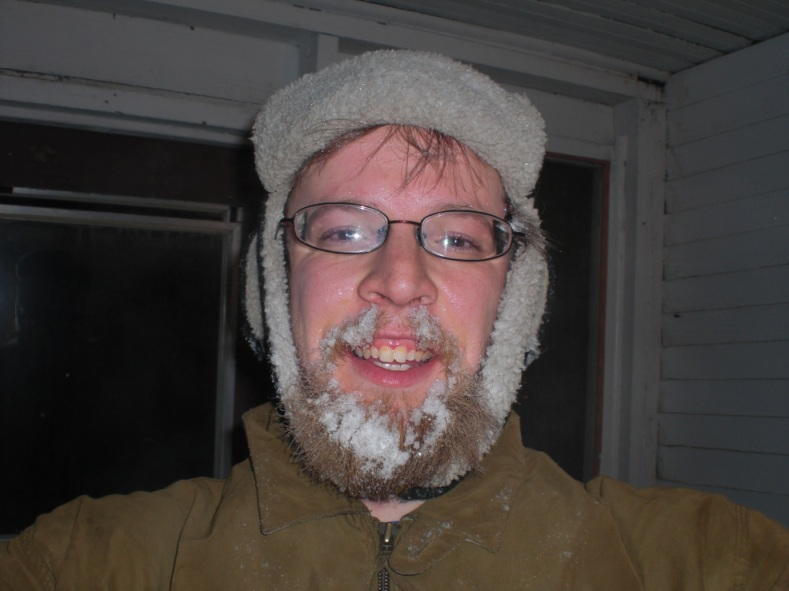

title: A Soliloquy on Beards
date: 2011-01-14
categories: creative

Readers, I beg your attention for one moment, while I soliloquize
loquacious on this finest of topics.

For has their ever been a more apt sign of manliness than this hairy
friend? A man may be brawny and wise, but without these gifts of
nature a man may still only be seen as a boy. These filaments grown
on ones face are the very strings that become figurative ropes,
pulling a boy from his last vestiges of immaturity and forcing him
into the world of the adult.

The beard has, it could be said, numberless uses, but there are a
few which stand the test of time, and these few which all men do
enjoy. For what bearded man has not enjoyed the subtle pleasure of
gently pulling at his hairs while thinking upon some difficult
subject? Or what man with a curled mustache has not spent total
countless hours twirling those finely crafted gifts of nature?

And what greater natural respite from the bitter gale of cold winter
winds has a man known than a thick beard? If he were to consider his
beard as paltry, let him but lay a razor to those same hairs which now
protect him and the biting cold of winter will show him the folly of
his ways.

But to me, my dear reader, I hold one enjoyment above all others.

As I spend time outside in the winter air, my breath alights on my
beard, condensing and freezing to tiny droplets of ice. These crystals
growing on my face remind me in a compelling way of my manhood, and of
the Creators divine gift of the beard.

